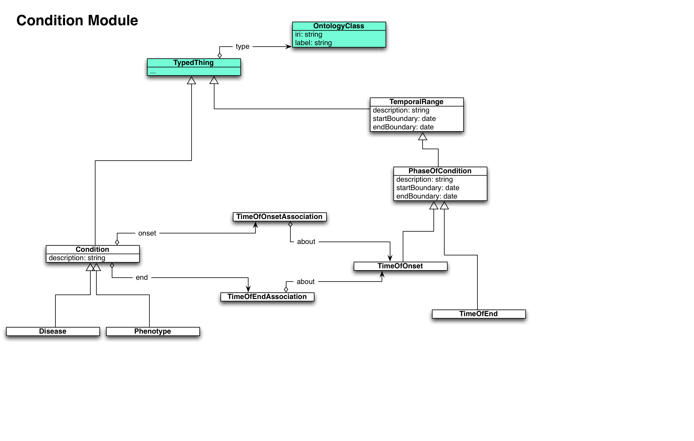

This repository contains documentation on the abstract data model used
in the Monarch project to represent phenotypes and associated
entities.

Modules are expressed as UML diagrams. It is a refence model: these
are not intended to be turned directly in object-oriented
classes. Different formats and representations can be derived from
this.

Note on relationship to ontology modeling: Monarch primarily relies on
ontology modeling, expressing knowledge and data as RDF/OWL. However,
sometimes it is necessary to express things as conventional
object-oriented information models. There will not necessarily 

See the text below for module descriptions

# Abstract Modules

## Ontology Module

 * [ontology module](ontology-module.md)

## Association Module

 * [association module](association-module.md)

# Domain Modules

## Condition Module

 * [condition module](condition-module.md)

## Causal Module

 * [causal module](causal-condition-module.md)

## Organism Module

 * [organism module](organism-module.md)

## Organism Condition Profile Module

 * [organism condition profile module](organism-condition-module.md)

