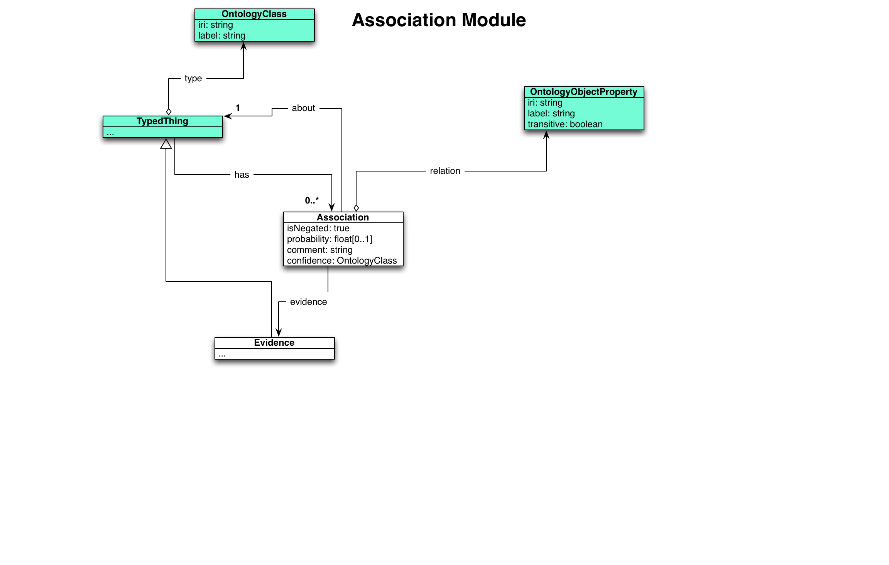

Represents any pairwise association between two typed things; for
example, a patient to a phenotype.

Note that associations never connect ontology classes - only things
that instantiate them. However, derived representations can infer
associations at the level of ontology classes.
